Below is the **rewritten Part 6 — Data Model**, updated to fit the **final architectural design**.

I kept the strongest parts of your previous data model:

* polyglot persistence
* request/workflow tracking
* artifact + chunk modeling
* retrieval query/result/context-pack logging
* test asset versioning
* execution, evidence, triage, defect, approval, learning, and audit records

I updated it to match the final architecture in these areas:

* **distributed understanding**
* **semantic state map as a first-class persisted concept**
* **requirement mismatch records**
* **dual execution modes**: diagnostic vs regression
* **forensic self-healing** and persistent healing logs
* **deterministic playbook export and promotion**
* **forensic-grade evidence schema**
* **local trigger / shift-left lineage**

Your previous data model was already strong on Graph-RAG observability and operational traceability. The main gap was that it did not yet fully model the final architecture’s **state layer**, **mismatch layer**, **healing layer**, **playbook layer**, and **trigger layer** explicitly enough. 

---

# Part 6 — Data Model

## AI QA Platform

### Final Architecture-Aligned Version

This section defines the **platform operational data model** for your AI-powered QA system.

This is the **application and persistence model**, not the knowledge graph model alone.

It covers the structured records needed for:

* request intake
* local trigger intake
* orchestration
* artifact ingestion
* distributed understanding
* semantic state modeling
* mismatch detection
* Graph-RAG preparation and retrieval
* test asset management
* execution tracking
* forensic-grade evidence storage metadata
* healing analysis and persistence
* deterministic playbook export
* triage
* defect drafting
* approval workflow
* learning signals
* platform governance
* retrieval and context-pack observability

You already have the **knowledge graph schema**.
This section complements that by defining the **operational records** that services will store and query.

---

# 1. Data Model Goals

The data model must support:

1. end-to-end request lifecycle tracking
2. versioned source and generated artifacts
3. deterministic and diagnostic execution records
4. evidence indexing
5. semantic state persistence
6. mismatch persistence
7. healing persistence
8. playbook persistence
9. triage and defect workflow
10. human review and approval
11. learning and improvement loops
12. traceability across relational records and graph entities
13. Graph-RAG preparation and runtime retrieval
14. context-pack auditability
15. future expansion without major redesign

---

# 2. Storage Strategy

Use a **polyglot persistence model**.

## 2.1 Recommended storage split

### Relational database

Use for:

* requests
* trigger events
* workflow state
* agent task records
* state maps and mismatch records
* run metadata
* test asset metadata
* approvals
* defect drafts
* playbook metadata
* healing logs
* structured service-owned operational records
* retrieval query logs
* context pack logs

### Object storage

Use for:

* raw artifacts
* generated files
* screenshots
* traces
* videos
* reports
* semantic trace files
* reasoning logs
* visual diff images
* large request/response snapshots
* compiled test artifacts
* playbook files
* healing reports

### Graph store

Use for:

* traceability relationships
* lineage
* requirement-to-state-to-test-to-defect queries
* graph expansion neighborhoods for Graph-RAG

### Search / vector index

Use for:

* chunk retrieval
* semantic search
* hybrid search over artifacts and history
* retrieval views and summaries
* state-map summaries
* evidence summaries
* healing summaries
* playbook summaries
* mismatch summaries

This preserves the strong prior storage split and extends it to the final architecture’s new persisted concepts. 

---

# 3. Primary Data Domains

The operational data model is divided into these domains:

1. Request domain
2. Trigger domain
3. Case domain
4. Artifact domain
5. Understanding domain
6. Semantic state domain
7. Mismatch domain
8. Retrieval domain
9. Workflow domain
10. Test asset domain
11. Execution domain
12. Evidence domain
13. Healing domain
14. Playbook domain
15. Triage domain
16. Defect domain
17. Approval domain
18. Learning domain
19. Audit / policy domain

The new explicit domains added for the final architecture are:

* Trigger
* Understanding
* Semantic state
* Mismatch
* Healing
* Playbook

---

# 4. ID Strategy

Use stable IDs with readable prefixes.

Examples:

* `REQ-1001` — request
* `TRG-1001` — trigger event
* `CASE-101` — case
* `ART-201` — artifact
* `CHUNK-9001` — artifact chunk
* `UNDERSTAND-1001` — fused case understanding
* `STATEMAP-1001` — semantic state map
* `STATE-1001` — semantic state entry
* `TRANS-1001` — transition
* `FP-1001` — element fingerprint
* `MM-1001` — mismatch warning
* `RV-2001` — retrieval view
* `RQLOG-1001` — retrieval query log
* `RRES-1001` — retrieval result log
* `CTXPACK-1001` — context pack log
* `WF-1001` — workflow instance
* `STRAT-1001` — strategy
* `SCN-2001` — scenario
* `TA-3001` — test asset
* `PLAYBOOK-1001` — deterministic playbook
* `RUN-3001` — run
* `EV-1001` — evidence
* `EVSUM-1001` — evidence summary
* `HEAL-1001` — healing event
* `HEALLOG-1001` — healing log
* `TRI-1001` — triage result
* `DD-9001` — defect draft
* `APP-1001` — approval task
* `DEC-1001` — review decision
* `LS-1001` — learning signal

This keeps debugging and traceability practical.

---

# 5. Request Domain

---

## 5.1 `qa_request`

Represents an inbound QA request.

| Field                   | Type               | Notes                                        |
| ----------------------- | ------------------ | -------------------------------------------- |
| id                      | string             | `REQ-*`                                      |
| external_request_id     | string nullable    | optional caller-provided id                  |
| submitted_by            | string             | user/service identity                        |
| source_type             | string             | `ui`, `api`, `schedule`, `system`, `trigger` |
| environment             | string             | `LOCAL`, `UAT`, `IST`, etc.                  |
| channels                | json/array         | `["web","api"]`                              |
| policy_profile          | string             | e.g. `standard-controlled`                   |
| priority                | string             | `low`, `medium`, `high`, `critical`          |
| status                  | string             | request lifecycle status                     |
| trigger_event_id        | string nullable    | FK to `trigger_event.id`                     |
| submitted_at            | timestamp          |                                              |
| accepted_at             | timestamp nullable |                                              |
| completed_at            | timestamp nullable |                                              |
| raw_payload_json        | json               | original request                             |
| normalized_payload_json | json               | normalized request                           |
| summary                 | text nullable      |                                              |

### Status examples

* `submitted`
* `accepted`
* `in_progress`
* `completed`
* `partial`
* `failed`
* `cancelled`

---

## 5.2 `qa_request_case`

Join table between request and cases.

| Field       | Type   | Notes                                    |
| ----------- | ------ | ---------------------------------------- |
| id          | string |                                          |
| request_id  | string | FK to `qa_request.id`                    |
| case_id     | string | FK to `qa_case.id`                       |
| order_index | int    | optional ordering                        |
| source      | string | `request`, `derived`, `trigger_inferred` |
| status      | string | per-case request status                  |

---

## 5.3 `qa_request_source_url`

Stores browser-readable URLs included in a request.

| Field                | Type            | Notes                                               |
| -------------------- | --------------- | --------------------------------------------------- |
| id                   | string          |                                                     |
| request_id           | string          |                                                     |
| url                  | text            |                                                     |
| url_type             | string nullable | `story_page`, `defect_page`, `wiki_page`, `unknown` |
| auth_profile         | string nullable |                                                     |
| read_mode            | string          | usually `read_only`                                 |
| status               | string          | `pending`, `captured`, `failed`                     |
| captured_artifact_id | string nullable | FK to artifact                                      |
| created_at           | timestamp       |                                                     |

---

# 6. Trigger Domain

This is new and required by the final architecture.

---

## 6.1 `trigger_event`

Represents a local or derived trigger.

| Field                  | Type            | Notes                                                         |
| ---------------------- | --------------- | ------------------------------------------------------------- |
| id                     | string          | `TRG-*`                                                       |
| trigger_type           | string          | `pre_commit`, `watch_mode`, `manual_local`, `request_gateway` |
| actor_id               | string nullable | developer/service identity                                    |
| environment            | string          | often `LOCAL`                                                 |
| git_diff_files_json    | json nullable   | changed files if relevant                                     |
| inferred_case_ids_json | json nullable   | affected cases                                                |
| status                 | string          | `received`, `translated`, `failed`                            |
| summary                | text nullable   |                                                               |
| created_at             | timestamp       |                                                               |

This is one of the key missing operational pieces in the prior model.

---

# 7. Case Domain

---

## 7.1 `qa_case`

Represents a managed case definition.

| Field            | Type            | Notes                         |
| ---------------- | --------------- | ----------------------------- |
| id               | string          | `CASE-*`                      |
| name             | string unique   | e.g. `login-flow`             |
| feature          | string nullable |                               |
| priority         | string          |                               |
| status           | string          | `active`, `inactive`, `draft` |
| root_path        | text            | folder path                   |
| manifest_version | int             |                               |
| description      | text nullable   |                               |
| created_at       | timestamp       |                               |
| updated_at       | timestamp       |                               |

---

## 7.2 `qa_case_version`

Optional but recommended.

| Field                  | Type      | Notes |
| ---------------------- | --------- | ----- |
| id                     | string    |       |
| case_id                | string    |       |
| version_no             | int       |       |
| manifest_snapshot_json | json      |       |
| checksum               | string    |       |
| created_at             | timestamp |       |

---

# 8. Artifact Domain

---

## 8.1 `artifact`

Represents any ingested source artifact.

| Field         | Type               | Notes                                                                                                                                          |
| ------------- | ------------------ | ---------------------------------------------------------------------------------------------------------------------------------------------- |
| id            | string             | `ART-*`                                                                                                                                        |
| case_id       | string nullable    |                                                                                                                                                |
| request_id    | string nullable    | request-scoped captures                                                                                                                        |
| artifact_type | string             | `story`, `wireframe`, `screenshot`, `defect_doc`, `api_spec`, `rule_doc`, `expected_result_doc`, `url_capture`, `generated_summary`, `unknown` |
| source_type   | string             | `folder`, `browser_url`, `generated`, `system`                                                                                                 |
| source_path   | text nullable      |                                                                                                                                                |
| source_url    | text nullable      |                                                                                                                                                |
| mime_type     | string nullable    |                                                                                                                                                |
| checksum      | string nullable    |                                                                                                                                                |
| title         | string nullable    |                                                                                                                                                |
| summary       | text nullable      |                                                                                                                                                |
| storage_ref   | text nullable      | object storage or file ref                                                                                                                     |
| parse_status  | string             | `pending`, `parsed`, `partial`, `failed`                                                                                                       |
| captured_at   | timestamp nullable |                                                                                                                                                |
| created_at    | timestamp          |                                                                                                                                                |
| updated_at    | timestamp          |                                                                                                                                                |

---

## 8.2 `artifact_chunk`

Used for retrieval and structured parsing.

| Field             | Type            | Notes                                                                                                                                  |
| ----------------- | --------------- | -------------------------------------------------------------------------------------------------------------------------------------- |
| id                | string          | `CHUNK-*`                                                                                                                              |
| artifact_id       | string          |                                                                                                                                        |
| chunk_type        | string          | `section`, `paragraph`, `table`, `ocr`, `summary`, `acceptance_criteria`, `rule_block`, `api_block`, `defect_summary`, `state_summary` |
| section_name      | string nullable |                                                                                                                                        |
| title             | string nullable |                                                                                                                                        |
| order_index       | int             |                                                                                                                                        |
| text              | text            |                                                                                                                                        |
| token_count       | int nullable    |                                                                                                                                        |
| metadata_json     | json nullable   | enriched refs/filters                                                                                                                  |
| retrieval_indexed | boolean         |                                                                                                                                        |
| source_quality    | string nullable | `high`, `medium`, `low`                                                                                                                |
| created_at        | timestamp       |                                                                                                                                        |

This remains a first-class grounding table, now extended for semantic-state-related chunking too. 

---

## 8.3 `artifact_parse_result`

Stores parser-specific extraction outputs.

| Field          | Type             | Notes                                                    |
| -------------- | ---------------- | -------------------------------------------------------- |
| id             | string           |                                                          |
| artifact_id    | string           |                                                          |
| parser_type    | string           | `doc_parser`, `browser_reader`, `vision_extractor`, etc. |
| parser_version | string           |                                                          |
| extracted_json | json             | headings, entities, sections, fields                     |
| confidence     | decimal nullable |                                                          |
| warnings_json  | json nullable    |                                                          |
| created_at     | timestamp        |                                                          |

---

# 9. Understanding Domain

This is new.

---

## 9.1 `case_understanding`

Represents fused case understanding produced from distributed understanding.

| Field                | Type            | Notes          |
| -------------------- | --------------- | -------------- |
| id                   | string          | `UNDERSTAND-*` |
| case_id              | string          |                |
| request_id           | string nullable |                |
| summary              | text            |                |
| features_json        | json nullable   |                |
| flows_json           | json nullable   |                |
| pages_json           | json nullable   |                |
| apis_json            | json nullable   |                |
| rules_json           | json nullable   |                |
| validations_json     | json nullable   |                |
| conflicts_json       | json nullable   |                |
| gaps_json            | json nullable   |                |
| generated_by_task_id | string nullable |                |
| version_no           | int             |                |
| created_at           | timestamp       |                |
| updated_at           | timestamp       |                |

This record supports the final architecture’s distributed understanding model.

---

# 10. Semantic State Domain

This is one of the biggest additions.

---

## 10.1 `semantic_state_map`

Represents the state model for a case.

| Field                | Type            | Notes                           |
| -------------------- | --------------- | ------------------------------- |
| id                   | string          | `STATEMAP-*`                    |
| case_id              | string          |                                 |
| request_id           | string nullable |                                 |
| name                 | string          |                                 |
| summary              | text nullable   |                                 |
| version_no           | int             |                                 |
| status               | string          | `draft`, `active`, `superseded` |
| generated_by_task_id | string nullable |                                 |
| retrieval_view_id    | string nullable | summary for retrieval           |
| created_at           | timestamp       |                                 |
| updated_at           | timestamp       |                                 |

---

## 10.2 `semantic_state`

Represents an observable UI or business state.

| Field         | Type            | Notes                                                                                   |
| ------------- | --------------- | --------------------------------------------------------------------------------------- |
| id            | string          | `STATE-*`                                                                               |
| state_map_id  | string          |                                                                                         |
| name          | string          |                                                                                         |
| state_type    | string          | `page_ready`, `validation_visible`, `component_stable`, `api_outcome`, `business_state` |
| page_ref      | string nullable |                                                                                         |
| description   | text nullable   |                                                                                         |
| metadata_json | json nullable   |                                                                                         |
| created_at    | timestamp       |                                                                                         |

---

## 10.3 `state_transition`

Represents a transition between states.

| Field           | Type            | Notes                                                     |
| --------------- | --------------- | --------------------------------------------------------- |
| id              | string          | `TRANS-*`                                                 |
| state_map_id    | string          |                                                           |
| from_state_ref  | string nullable |                                                           |
| to_state_ref    | string nullable |                                                           |
| name            | string          |                                                           |
| transition_type | string          | `user_action_to_state`, `api_to_state`, `system_to_state` |
| description     | text nullable   |                                                           |
| metadata_json   | json nullable   |                                                           |
| created_at      | timestamp       |                                                           |

---

## 10.4 `expected_outcome`

Represents the intended outcome associated with a state or transition.

| Field          | Type            | Notes       |
| -------------- | --------------- | ----------- |
| id             | string          | `OUTCOME-*` |
| state_map_id   | string          |             |
| state_ref      | string nullable |             |
| transition_ref | string nullable |             |
| name           | string          |             |
| description    | text            |             |
| created_at     | timestamp       |             |

---

## 10.5 `element_fingerprint`

Represents a multi-attribute fingerprint of a UI element.

| Field            | Type            | Notes                                              |
| ---------------- | --------------- | -------------------------------------------------- |
| id               | string          | `FP-*`                                             |
| state_map_id     | string          |                                                    |
| page_ref         | string nullable |                                                    |
| element_name     | string          |                                                    |
| fingerprint_json | json            | role, label, text, classes, DOM neighborhood, etc. |
| stability        | string nullable | `low`, `medium`, `high`                            |
| version_no       | int             |                                                    |
| created_at       | timestamp       |                                                    |
| updated_at       | timestamp       |                                                    |

This is required for the final architecture’s forensic healing design.

---

# 11. Mismatch Domain

This is new.

---

## 11.1 `mismatch_warning`

Represents a detected requirement or artifact mismatch.

| Field              | Type            | Notes                                                                                                         |
| ------------------ | --------------- | ------------------------------------------------------------------------------------------------------------- |
| id                 | string          | `MM-*`                                                                                                        |
| case_id            | string          |                                                                                                               |
| request_id         | string nullable |                                                                                                               |
| state_map_id       | string nullable |                                                                                                               |
| mismatch_type      | string          | `story_wireframe_conflict`, `wireframe_screenshot_conflict`, `state_expectation_conflict`, `rule_ui_conflict` |
| severity           | string          | `low`, `medium`, `high`, `blocking`                                                                           |
| summary            | text            |                                                                                                               |
| source_refs_json   | json            |                                                                                                               |
| status             | string          | `open`, `accepted`, `resolved`, `ignored`                                                                     |
| created_by_task_id | string nullable |                                                                                                               |
| retrieval_view_id  | string nullable | summary for retrieval                                                                                         |
| created_at         | timestamp       |                                                                                                               |
| updated_at         | timestamp       |                                                                                                               |

This is another key final-architecture addition.

---

# 12. Retrieval Domain

---

## 12.1 `retrieval_view`

Represents a retrieval-friendly summary of an entity or artifact.

Examples:

* approved test asset summary
* defect summary
* defect draft summary
* run summary
* triage summary
* evidence summary
* state-map summary
* mismatch summary
* healing summary
* playbook summary

| Field             | Type            | Notes                                                                                                                                                                       |
| ----------------- | --------------- | --------------------------------------------------------------------------------------------------------------------------------------------------------------------------- |
| id                | string          | `RV-*`                                                                                                                                                                      |
| source_type       | string          | `artifact`, `test_asset`, `triage_result`, `defect_draft`, `evidence`, `run`, `state_map`, `mismatch_warning`, `healing_event`, `playbook`                                  |
| source_id         | string          |                                                                                                                                                                             |
| case_id           | string nullable |                                                                                                                                                                             |
| view_type         | string          | `test_asset_summary`, `defect_summary`, `run_summary`, `triage_summary`, `evidence_summary`, `state_map_summary`, `mismatch_summary`, `healing_summary`, `playbook_summary` |
| title             | string nullable |                                                                                                                                                                             |
| text              | text            |                                                                                                                                                                             |
| metadata_json     | json nullable   | filters like flow/page/state/api refs                                                                                                                                       |
| approval_status   | string nullable |                                                                                                                                                                             |
| retrieval_indexed | boolean         |                                                                                                                                                                             |
| created_at        | timestamp       |                                                                                                                                                                             |
| updated_at        | timestamp       |                                                                                                                                                                             |

This table was already strong, but now it must cover final-architecture state, healing, and playbook retrieval too. 

---

## 12.2 `retrieval_query_log`

Tracks each retrieval request.

| Field                   | Type            | Notes                                                                                                                           |
| ----------------------- | --------------- | ------------------------------------------------------------------------------------------------------------------------------- |
| id                      | string          | `RQLOG-*`                                                                                                                       |
| agent_task_id           | string nullable |                                                                                                                                 |
| request_id              | string nullable |                                                                                                                                 |
| case_id                 | string nullable |                                                                                                                                 |
| mode                    | string          | `case_understanding`, `mapping`, `strategy`, `authoring`, `triage`, `defect_drafting`, `learning`, `healing`, `playbook_review` |
| query_text              | text            |                                                                                                                                 |
| filters_json            | json            |                                                                                                                                 |
| include_history         | boolean         |                                                                                                                                 |
| graph_expansion_enabled | boolean         |                                                                                                                                 |
| created_at              | timestamp       |                                                                                                                                 |

---

## 12.3 `retrieval_result_log`

Stores the candidates returned for a retrieval query.

| Field                | Type             | Notes                                       |
| -------------------- | ---------------- | ------------------------------------------- |
| id                   | string           | `RRES-*`                                    |
| retrieval_query_id   | string           | FK to `retrieval_query_log.id`              |
| source_type          | string           | `chunk`, `retrieval_view`, `entity_summary` |
| source_id            | string           |                                             |
| raw_score            | decimal          |                                             |
| reranked_score       | decimal nullable |                                             |
| selected_for_context | boolean          |                                             |
| selection_reason     | text nullable    |                                             |
| created_at           | timestamp        |                                             |

---

## 12.4 `context_pack_log`

Stores the final context pack used for an agent task.

| Field              | Type            | Notes                                                                                                     |
| ------------------ | --------------- | --------------------------------------------------------------------------------------------------------- |
| id                 | string          | `CTXPACK-*`                                                                                               |
| agent_task_id      | string          |                                                                                                           |
| case_id            | string nullable |                                                                                                           |
| context_type       | string          | `mapping`, `strategy`, `authoring`, `triage`, `defect_drafting`, `learning`, `healing`, `playbook_review` |
| execution_mode     | string nullable | `diagnostic`, `regression`                                                                                |
| summary            | text nullable   |                                                                                                           |
| included_refs_json | json            | list of chunk/entity/asset refs                                                                           |
| size_metrics_json  | json nullable   | token counts, chunk count, asset count                                                                    |
| created_at         | timestamp       |                                                                                                           |

### Important final-architecture additions

* `execution_mode`
* ability to include state refs, mismatch refs, playbook refs, healing refs inside `included_refs_json`

---

## 12.5 `context_pack_item`

Optional normalized join table for context contents.

| Field           | Type      | Notes                                                                                                                                 |
| --------------- | --------- | ------------------------------------------------------------------------------------------------------------------------------------- |
| id              | string    |                                                                                                                                       |
| context_pack_id | string    |                                                                                                                                       |
| item_type       | string    | `chunk`, `requirement`, `flow`, `page`, `state`, `transition`, `api`, `asset`, `history`, `defect`, `mismatch`, `playbook`, `healing` |
| item_ref        | string    |                                                                                                                                       |
| order_index     | int       |                                                                                                                                       |
| created_at      | timestamp |                                                                                                                                       |

---

# 13. Workflow Domain

---

## 13.1 `workflow_instance`

Represents the orchestration lifecycle for a request.

| Field              | Type               | Notes                |
| ------------------ | ------------------ | -------------------- |
| id                 | string             | `WF-*`               |
| request_id         | string             |                      |
| status             | string             |                      |
| current_stage      | string             |                      |
| retry_count        | int                |                      |
| started_at         | timestamp          |                      |
| ended_at           | timestamp nullable |                      |
| last_error_code    | string nullable    |                      |
| last_error_message | text nullable      |                      |
| context_json       | json nullable      | workflow-level state |
| created_at         | timestamp          |                      |
| updated_at         | timestamp          |                      |

---

## 13.2 `workflow_stage_execution`

Stores stage-by-stage execution history.

| Field           | Type               | Notes                                                                                                                                                                                             |
| --------------- | ------------------ | ------------------------------------------------------------------------------------------------------------------------------------------------------------------------------------------------- |
| id              | string             |                                                                                                                                                                                                   |
| workflow_id     | string             |                                                                                                                                                                                                   |
| stage_name      | string             | `ingestion`, `fusion`, `state_map`, `mismatch_detection`, `indexing`, `context_build`, `mapping`, `strategy`, `authoring`, `execution`, `healing`, `triage`, `defect_drafting`, `playbook_export` |
| status          | string             | `pending`, `running`, `completed`, `failed`, `partial`, `waiting_approval`                                                                                                                        |
| attempt_no      | int                |                                                                                                                                                                                                   |
| started_at      | timestamp          |                                                                                                                                                                                                   |
| ended_at        | timestamp nullable |                                                                                                                                                                                                   |
| input_ref_json  | json nullable      |                                                                                                                                                                                                   |
| output_ref_json | json nullable      |                                                                                                                                                                                                   |
| error_json      | json nullable      |                                                                                                                                                                                                   |
| created_at      | timestamp          |                                                                                                                                                                                                   |

This is one of the places where the final architecture changes are very visible.

---

## 13.3 `agent_task_execution`

Represents one agent invocation.

| Field             | Type               | Notes                       |
| ----------------- | ------------------ | --------------------------- |
| id                | string             | `TASK-*`                    |
| workflow_id       | string             |                             |
| request_id        | string             |                             |
| case_id           | string nullable    |                             |
| agent_name        | string             |                             |
| prompt_version    | string             |                             |
| model_profile     | string             |                             |
| context_pack_id   | string nullable    | FK to `context_pack_log.id` |
| execution_mode    | string nullable    | `diagnostic`, `regression`  |
| status            | string             |                             |
| input_json        | json               | ideally sanitized           |
| output_json       | json nullable      |                             |
| confidence        | decimal nullable   |                             |
| confidence_reason | text nullable      |                             |
| started_at        | timestamp          |                             |
| ended_at          | timestamp nullable |                             |
| error_json        | json nullable      |                             |
| created_at        | timestamp          |                             |

This now explicitly supports mode-aware agent behavior too.

---

# 14. Test Asset Domain

---

## 14.1 `test_strategy`

Represents a generated strategy record.

| Field                | Type            | Notes                                      |
| -------------------- | --------------- | ------------------------------------------ |
| id                   | string          | `STRAT-*`                                  |
| case_id              | string          |                                            |
| request_id           | string nullable |                                            |
| status               | string          | `draft`, `reviewed`, `approved`, `retired` |
| summary              | text            |                                            |
| generated_by_task_id | string nullable |                                            |
| storage_ref          | text nullable   | optional full document                     |
| created_at           | timestamp       |                                            |
| updated_at           | timestamp       |                                            |

---

## 14.2 `test_scenario`

Represents a scenario-level record.

| Field              | Type            | Notes                            |
| ------------------ | --------------- | -------------------------------- |
| id                 | string          | `SCN-*`                          |
| case_id            | string          |                                  |
| strategy_id        | string nullable |                                  |
| name               | string          |                                  |
| description        | text nullable   |                                  |
| target_channel     | string          | `web`, `api`, `visual`, `hybrid` |
| priority           | string          |                                  |
| status             | string          |                                  |
| setup_needs_json   | json nullable   |                                  |
| cleanup_needs_json | json nullable   |                                  |
| metadata_json      | json nullable   |                                  |
| created_at         | timestamp       |                                  |
| updated_at         | timestamp       |                                  |

---

## 14.3 `test_asset`

Represents a versioned executable or structured artifact.

| Field                        | Type            | Notes                                                                                               |
| ---------------------------- | --------------- | --------------------------------------------------------------------------------------------------- |
| id                           | string          | `TA-*`                                                                                              |
| case_id                      | string          |                                                                                                     |
| scenario_id                  | string nullable |                                                                                                     |
| asset_type                   | string          | `playwright_test`, `api_test_spec`, `structured_spec`, `fixture`, `flow_module`, `assertion_module` |
| name                         | string          |                                                                                                     |
| status                       | string          | `draft`, `reviewed`, `approved`, `active`, `deprecated`, `retired`                                  |
| current_version_no           | int             |                                                                                                     |
| generated_by_task_id         | string nullable |                                                                                                     |
| linked_requirement_refs_json | json nullable   |                                                                                                     |
| linked_flow_refs_json        | json nullable   |                                                                                                     |
| linked_state_refs_json       | json nullable   |                                                                                                     |
| linked_mismatch_refs_json    | json nullable   |                                                                                                     |
| active_playbook_id           | string nullable | FK to `deterministic_playbook.id`                                                                   |
| retrieval_view_id            | string nullable | FK to `retrieval_view.id` for summary                                                               |
| created_at                   | timestamp       |                                                                                                     |
| updated_at                   | timestamp       |                                                                                                     |

This is a key final-architecture update:

* state refs
* mismatch refs
* playbook linkage

---

## 14.4 `test_asset_version`

Stores immutable asset versions.

| Field               | Type            | Notes                                    |
| ------------------- | --------------- | ---------------------------------------- |
| id                  | string          |                                          |
| test_asset_id       | string          |                                          |
| version_no          | int             |                                          |
| content_type        | string          | `typescript`, `json`, `yaml`, `markdown` |
| content_storage_ref | text            |                                          |
| checksum            | string          |                                          |
| prompt_version      | string nullable |                                          |
| model_profile       | string nullable |                                          |
| context_pack_id     | string nullable |                                          |
| state_map_id        | string nullable |                                          |
| playbook_id         | string nullable |                                          |
| metadata_json       | json nullable   |                                          |
| created_at          | timestamp       |                                          |

This preserves the architectural lineage of generated versions.

---

## 14.5 `test_assertion`

Represents assertions linked to scenarios/assets.

| Field          | Type            | Notes                                                                              |
| -------------- | --------------- | ---------------------------------------------------------------------------------- |
| id             | string          | `ASRT-*`                                                                           |
| scenario_id    | string nullable |                                                                                    |
| test_asset_id  | string nullable |                                                                                    |
| assertion_type | string          | `technical`, `semantic`, `business_outcome`, `api_state`, `validation`, `ui_state` |
| name           | string          |                                                                                    |
| description    | text nullable   |                                                                                    |
| expected_json  | json nullable   |                                                                                    |
| created_at     | timestamp       |                                                                                    |

---

# 15. Playbook Domain

This is new.

---

## 15.1 `deterministic_playbook`

Represents a reusable deterministic playbook discovered from diagnostic mode.

| Field             | Type            | Notes                                                                   |
| ----------------- | --------------- | ----------------------------------------------------------------------- |
| id                | string          | `PLAYBOOK-*`                                                            |
| case_id           | string          |                                                                         |
| scenario_id       | string nullable |                                                                         |
| name              | string          |                                                                         |
| status            | string          | `discovered`, `exported`, `reviewed`, `approved`, `rejected`, `retired` |
| source_run_id     | string          | originating diagnostic run                                              |
| summary           | text nullable   |                                                                         |
| storage_ref       | text nullable   | playbook file                                                           |
| retrieval_view_id | string nullable | summary for retrieval                                                   |
| created_at        | timestamp       |                                                                         |
| updated_at        | timestamp       |                                                                         |

---

## 15.2 `playbook_signal`

Represents a discovered state signal or deterministic wait/action pattern.

| Field       | Type            | Notes                                                                                       |
| ----------- | --------------- | ------------------------------------------------------------------------------------------- |
| id          | string          | `PSIG-*`                                                                                    |
| playbook_id | string          |                                                                                             |
| signal_type | string          | `spinner_hidden`, `component_ready`, `route_stable`, `validation_visible`, `button_enabled` |
| target_ref  | string nullable | linked state ref or element ref                                                             |
| signal_json | json            |                                                                                             |
| order_index | int             |                                                                                             |
| created_at  | timestamp       |                                                                                             |

This is required by the final architecture’s diagnostic-to-regression promotion flow.

---

# 16. Execution Domain

---

## 16.1 `execution_run`

Represents a run of one or more test assets.

| Field                  | Type               | Notes                                                                       |
| ---------------------- | ------------------ | --------------------------------------------------------------------------- |
| id                     | string             | `RUN-*`                                                                     |
| request_id             | string             |                                                                             |
| case_id                | string             |                                                                             |
| trigger_event_id       | string nullable    | FK to `trigger_event.id`                                                    |
| environment            | string             |                                                                             |
| run_type               | string             | `web`, `api`, `hybrid`                                                      |
| mode                   | string             | `draft`, `regression`, `diagnostic`                                         |
| status                 | string             | `pending`, `running`, `passed`, `failed`, `partial`, `blocked`, `cancelled` |
| started_at             | timestamp          |                                                                             |
| ended_at               | timestamp nullable |                                                                             |
| execution_context_json | json nullable      | browser, auth profile, etc.                                                 |
| state_map_id           | string nullable    |                                                                             |
| playbook_id            | string nullable    |                                                                             |
| summary                | text nullable      |                                                                             |
| retrieval_view_id      | string nullable    | summary for historical retrieval                                            |
| created_at             | timestamp          |                                                                             |
| updated_at             | timestamp          |                                                                             |

---

## 16.2 `execution_run_asset`

Join table between run and asset.

| Field         | Type      | Notes                |
| ------------- | --------- | -------------------- |
| id            | string    |                      |
| run_id        | string    |                      |
| test_asset_id | string    |                      |
| order_index   | int       |                      |
| status        | string    | per-asset run result |
| created_at    | timestamp |                      |

---

## 16.3 `execution_run_step`

Represents fine-grained execution steps.

| Field              | Type               | Notes                                                                |
| ------------------ | ------------------ | -------------------------------------------------------------------- |
| id                 | string             | `RUNSTEP-*`                                                          |
| run_id             | string             |                                                                      |
| test_asset_id      | string nullable    |                                                                      |
| scenario_id        | string nullable    |                                                                      |
| order_index        | int                |                                                                      |
| action_type        | string             | `navigate`, `fill`, `click`, `assert`, `wait_for_state_signal`, etc. |
| target_json        | json nullable      |                                                                      |
| input_value_ref    | string nullable    |                                                                      |
| expected_state_ref | string nullable    |                                                                      |
| status             | string             | `passed`, `failed`, `skipped`                                        |
| started_at         | timestamp          |                                                                      |
| ended_at           | timestamp nullable |                                                                      |
| duration_ms        | int nullable       |                                                                      |
| error_code         | string nullable    |                                                                      |
| error_message      | text nullable      |                                                                      |
| metadata_json      | json nullable      |                                                                      |
| created_at         | timestamp          |                                                                      |

The addition of `expected_state_ref` is important for final-architecture state-aware execution.

---

## 16.4 `execution_context`

Optional normalized context table.

| Field             | Type            | Notes   |
| ----------------- | --------------- | ------- |
| id                | string          | `CTX-*` |
| run_id            | string          |         |
| browser           | string nullable |         |
| base_url          | text nullable   |         |
| auth_profile      | string nullable |         |
| storage_state_ref | text nullable   |         |
| state_profile     | string nullable |         |
| config_json       | json nullable   |         |
| created_at        | timestamp       |         |

---

# 17. Evidence Domain

---

## 17.1 `evidence`

Represents evidence metadata.

| Field         | Type            | Notes                                                                                                                                                           |
| ------------- | --------------- | --------------------------------------------------------------------------------------------------------------------------------------------------------------- |
| id            | string          | `EV-*`                                                                                                                                                          |
| run_id        | string          |                                                                                                                                                                 |
| run_step_id   | string nullable |                                                                                                                                                                 |
| evidence_type | string          | `screenshot`, `video`, `trace`, `har`, `dom_snapshot`, `console_log`, `api_request`, `api_response`, `bundle`, `semantic_trace`, `reasoning_log`, `visual_diff` |
| name          | string          |                                                                                                                                                                 |
| storage_ref   | text            | object storage ref                                                                                                                                              |
| mime_type     | string nullable |                                                                                                                                                                 |
| checksum      | string nullable |                                                                                                                                                                 |
| metadata_json | json nullable   |                                                                                                                                                                 |
| created_at    | timestamp       |                                                                                                                                                                 |

This is one of the most important final-architecture upgrades.

---

## 17.2 `evidence_summary`

Retrieval-friendly evidence summaries.

| Field             | Type            | Notes                                                                                        |
| ----------------- | --------------- | -------------------------------------------------------------------------------------------- |
| id                | string          | `EVSUM-*`                                                                                    |
| evidence_id       | string          |                                                                                              |
| run_id            | string          |                                                                                              |
| summary_type      | string          | `triage_support`, `defect_support`, `history_support`, `healing_support`, `playbook_support` |
| text              | text            |                                                                                              |
| retrieval_view_id | string nullable |                                                                                              |
| created_at        | timestamp       |                                                                                              |

---

## 17.3 `evidence_bundle`

Represents a grouped evidence package.

| Field       | Type          | Notes                                                   |
| ----------- | ------------- | ------------------------------------------------------- |
| id          | string        | `BUNDLE-*`                                              |
| run_id      | string        |                                                         |
| bundle_type | string        | `triage`, `defect_draft`, `report`, `diagnostic_export` |
| storage_ref | text nullable | bundled archive/report                                  |
| summary     | text nullable |                                                         |
| created_at  | timestamp     |                                                         |

---

## 17.4 `evidence_bundle_item`

Join table for bundle contents.

| Field       | Type      | Notes |
| ----------- | --------- | ----- |
| id          | string    |       |
| bundle_id   | string    |       |
| evidence_id | string    |       |
| order_index | int       |       |
| created_at  | timestamp |       |

---

# 18. Healing Domain

This is new.

---

## 18.1 `healing_event`

Represents a healing proposal or runtime healing outcome.

| Field              | Type             | Notes                                                            |
| ------------------ | ---------------- | ---------------------------------------------------------------- |
| id                 | string           | `HEAL-*`                                                         |
| run_id             | string           |                                                                  |
| run_step_id        | string nullable  |                                                                  |
| case_id            | string           |                                                                  |
| fingerprint_id     | string nullable  |                                                                  |
| original_target    | text             |                                                                  |
| proposed_target    | text nullable    |                                                                  |
| confidence         | decimal nullable |                                                                  |
| confidence_reason  | text nullable    |                                                                  |
| status             | string           | `proposed`, `applied_runtime`, `rejected`, `approved_for_update` |
| review_required    | boolean          |                                                                  |
| created_by_task_id | string nullable  |                                                                  |
| retrieval_view_id  | string nullable  | summary for retrieval                                            |
| created_at         | timestamp        |                                                                  |
| updated_at         | timestamp        |                                                                  |

---

## 18.2 `healing_log`

Represents the persistent healing log record.

| Field            | Type          | Notes              |
| ---------------- | ------------- | ------------------ |
| id               | string        | `HEALLOG-*`        |
| healing_event_id | string        |                    |
| case_id          | string        |                    |
| storage_ref      | text nullable | persisted file/log |
| summary          | text          |                    |
| created_at       | timestamp     |                    |

This is explicitly required by the final architecture.

---

# 19. Triage Domain

---

## 19.1 `triage_result`

Represents structured run interpretation.

| Field               | Type            | Notes                                                                                                                                                                      |
| ------------------- | --------------- | -------------------------------------------------------------------------------------------------------------------------------------------------------------------------- |
| id                  | string          | `TRI-*`                                                                                                                                                                    |
| run_id              | string          |                                                                                                                                                                            |
| classification      | string          | `probable_product_defect`, `probable_test_issue`, `probable_environment_issue`, `probable_auth_issue`, `probable_data_issue`, `probable_flaky_issue`, `needs_human_review` |
| confidence          | decimal         | 0.0 - 1.0                                                                                                                                                                  |
| confidence_reason   | text            |                                                                                                                                                                            |
| inferred_cause      | text nullable   |                                                                                                                                                                            |
| suggested_action    | string          | `draft_defect`, `review`, `rerun`, `fix_test`, etc.                                                                                                                        |
| observed_facts_json | json            |                                                                                                                                                                            |
| ambiguities_json    | json nullable   |                                                                                                                                                                            |
| created_by_task_id  | string nullable |                                                                                                                                                                            |
| retrieval_view_id   | string nullable | summary for history                                                                                                                                                        |
| created_at          | timestamp       |                                                                                                                                                                            |

---

## 19.2 `triage_supporting_evidence`

Join table between triage result and evidence.

| Field            | Type          | Notes |
| ---------------- | ------------- | ----- |
| id               | string        |       |
| triage_result_id | string        |       |
| evidence_id      | string        |       |
| reason           | text nullable |       |
| created_at       | timestamp     |       |

---

## 19.3 `triage_history_link`

Links current triage to historical retrieved items.

| Field            | Type             | Notes                                                                                                 |
| ---------------- | ---------------- | ----------------------------------------------------------------------------------------------------- |
| id               | string           |                                                                                                       |
| triage_result_id | string           |                                                                                                       |
| source_type      | string           | `run`, `triage_result`, `defect_draft`, `known_defect`, `retrieval_view`, `healing_event`, `playbook` |
| source_id        | string           |                                                                                                       |
| similarity_score | decimal nullable |                                                                                                       |
| purpose          | string           | `supporting_history`, `similar_case`, `defect_similarity`, `healing_similarity`                       |
| created_at       | timestamp        |                                                                                                       |

This is now broader and better aligned with the final architecture’s forensic workflow.

---

# 20. Defect Domain

---

## 20.1 `known_defect`

Represents ingested defects from source materials.

| Field              | Type            | Notes                                                     |
| ------------------ | --------------- | --------------------------------------------------------- |
| id                 | string          | `BUG-*` or normalized internal id                         |
| case_id            | string nullable |                                                           |
| source_system      | string          | `browser_url_capture`, `folder_doc`, future `jira`, `ado` |
| external_key       | string nullable |                                                           |
| title              | string          |                                                           |
| status             | string nullable |                                                           |
| severity           | string nullable |                                                           |
| summary            | text nullable   |                                                           |
| source_artifact_id | string nullable |                                                           |
| retrieval_view_id  | string nullable |                                                           |
| created_at         | timestamp       |                                                           |
| updated_at         | timestamp       |                                                           |

---

## 20.2 `defect_draft`

Represents a generated internal defect packet.

| Field                 | Type            | Notes                                                                       |
| --------------------- | --------------- | --------------------------------------------------------------------------- |
| id                    | string          | `DD-*`                                                                      |
| run_id                | string          |                                                                             |
| triage_result_id      | string          |                                                                             |
| case_id               | string          |                                                                             |
| title                 | string          |                                                                             |
| summary               | text            |                                                                             |
| expected_behavior     | text            |                                                                             |
| actual_behavior       | text            |                                                                             |
| severity_suggestion   | string nullable |                                                                             |
| confidence            | decimal         |                                                                             |
| review_recommendation | string          |                                                                             |
| status                | string          | `draft`, `review_pending`, `approved`, `rejected`, `submitted`, `duplicate` |
| created_by_task_id    | string nullable |                                                                             |
| retrieval_view_id     | string nullable |                                                                             |
| created_at            | timestamp       |                                                                             |
| updated_at            | timestamp       |                                                                             |

---

## 20.3 `defect_draft_step`

Repro steps for a defect draft.

| Field           | Type      | Notes |
| --------------- | --------- | ----- |
| id              | string    |       |
| defect_draft_id | string    |       |
| order_index     | int       |       |
| step_text       | text      |       |
| created_at      | timestamp |       |

---

## 20.4 `defect_draft_evidence`

Join table between defect draft and evidence.

| Field           | Type            | Notes                                                         |
| --------------- | --------------- | ------------------------------------------------------------- |
| id              | string          |                                                               |
| defect_draft_id | string          |                                                               |
| evidence_id     | string          |                                                               |
| purpose         | string nullable | `screenshot`, `trace`, `api_response`, `semantic_trace`, etc. |
| created_at      | timestamp       |                                                               |

---

## 20.5 `defect_similarity_link`

Stores similarity between a generated defect and known defects.

| Field            | Type          | Notes |
| ---------------- | ------------- | ----- |
| id               | string        |       |
| defect_draft_id  | string        |       |
| known_defect_id  | string        |       |
| similarity_score | decimal       |       |
| reasoning        | text nullable |       |
| created_at       | timestamp     |       |

---

# 21. Approval Domain

---

## 21.1 `approval_task`

Represents a human review item.

| Field        | Type               | Notes                                                                                                                                                             |
| ------------ | ------------------ | ----------------------------------------------------------------------------------------------------------------------------------------------------------------- |
| id           | string             | `APP-*`                                                                                                                                                           |
| request_id   | string             |                                                                                                                                                                   |
| case_id      | string nullable    |                                                                                                                                                                   |
| task_type    | string             | `defect_draft_review`, `healing_update_review`, `asset_promotion_review`, `playbook_promotion_review`, `low_confidence_result_review`, `mismatch_override_review` |
| target_type  | string             | `defect_draft`, `test_asset`, `triage_result`, `run`, `healing_event`, `deterministic_playbook`, `mismatch_warning`                                               |
| target_id    | string             |                                                                                                                                                                   |
| status       | string             | `pending`, `approved`, `rejected`, `expired`, `cancelled`                                                                                                         |
| priority     | string             |                                                                                                                                                                   |
| assigned_to  | string nullable    |                                                                                                                                                                   |
| reason       | text               |                                                                                                                                                                   |
| created_at   | timestamp          |                                                                                                                                                                   |
| due_at       | timestamp nullable |                                                                                                                                                                   |
| completed_at | timestamp nullable |                                                                                                                                                                   |

This is explicitly extended for healing, playbook, and mismatch governance.

---

## 21.2 `review_decision`

Represents a reviewer’s decision.

| Field            | Type          | Notes                                                                        |
| ---------------- | ------------- | ---------------------------------------------------------------------------- |
| id               | string        | `DEC-*`                                                                      |
| approval_task_id | string        |                                                                              |
| actor_id         | string        | reviewer identity                                                            |
| decision_type    | string        | `approve`, `reject`, `edit_and_approve`, `reclassify`, `mark_false_positive` |
| comment          | text nullable |                                                                              |
| payload_json     | json nullable | e.g. edited fields                                                           |
| created_at       | timestamp     |                                                                              |

---

## 21.3 `policy_decision_log`

Stores automated governance decisions.

| Field          | Type             | Notes                               |
| -------------- | ---------------- | ----------------------------------- |
| id             | string           |                                     |
| request_id     | string nullable  |                                     |
| run_id         | string nullable  |                                     |
| action_type    | string           |                                     |
| target_type    | string           |                                     |
| target_id      | string nullable  |                                     |
| policy_profile | string           |                                     |
| decision       | string           | `allow`, `deny`, `require_approval` |
| reason_code    | string           |                                     |
| reason_text    | text nullable    |                                     |
| confidence     | decimal nullable |                                     |
| created_at     | timestamp        |                                     |

---

# 22. Learning Domain

---

## 22.1 `learning_signal`

Represents reusable learning output.

| Field              | Type             | Notes                                                                                                                                                                                                          |
| ------------------ | ---------------- | -------------------------------------------------------------------------------------------------------------------------------------------------------------------------------------------------------------- |
| id                 | string           | `LS-*`                                                                                                                                                                                                         |
| signal_type        | string           | `selector_instability`, `repeated_env_issue`, `accepted_healing_pattern`, `rejected_healing_pattern`, `accepted_playbook_pattern`, `rejected_playbook_pattern`, `false_positive_pattern`, `flaky_flow_pattern` |
| case_id            | string nullable  |                                                                                                                                                                                                                |
| run_id             | string nullable  |                                                                                                                                                                                                                |
| test_asset_id      | string nullable  |                                                                                                                                                                                                                |
| page_ref           | string nullable  |                                                                                                                                                                                                                |
| flow_ref           | string nullable  |                                                                                                                                                                                                                |
| state_ref          | string nullable  |                                                                                                                                                                                                                |
| summary            | text             |                                                                                                                                                                                                                |
| severity           | string nullable  |                                                                                                                                                                                                                |
| confidence         | decimal nullable |                                                                                                                                                                                                                |
| created_by_task_id | string nullable  |                                                                                                                                                                                                                |
| retrieval_view_id  | string nullable  |                                                                                                                                                                                                                |
| created_at         | timestamp        |                                                                                                                                                                                                                |

---

## 22.2 `learning_signal_link`

Flexible linking table.

| Field              | Type      | Notes                                                                                                                       |
| ------------------ | --------- | --------------------------------------------------------------------------------------------------------------------------- |
| id                 | string    |                                                                                                                             |
| learning_signal_id | string    |                                                                                                                             |
| target_type        | string    | `run`, `test_asset`, `page`, `flow`, `state`, `review_decision`, `triage_result`, `healing_event`, `deterministic_playbook` |
| target_id          | string    |                                                                                                                             |
| relationship_type  | string    | `observed_in`, `relates_to`, `derived_from`                                                                                 |
| created_at         | timestamp |                                                                                                                             |

---

# 23. Audit / Policy Domain

---

## 23.1 `audit_log`

Central structured audit log.

| Field            | Type            | Notes                                |
| ---------------- | --------------- | ------------------------------------ |
| id               | string          |                                      |
| request_id       | string nullable |                                      |
| workflow_id      | string nullable |                                      |
| run_id           | string nullable |                                      |
| trigger_event_id | string nullable |                                      |
| service_name     | string          |                                      |
| actor_type       | string          | `user`, `service`, `agent`, `worker` |
| actor_id         | string          |                                      |
| action_type      | string          |                                      |
| target_type      | string nullable |                                      |
| target_id        | string nullable |                                      |
| status           | string          | `success`, `error`, `partial`        |
| details_json     | json nullable   |                                      |
| occurred_at      | timestamp       |                                      |

---

## 23.2 `tool_invocation_log`

Tracks MCP/tool calls.

| Field           | Type               | Notes             |
| --------------- | ------------------ | ----------------- |
| id              | string             |                   |
| request_id      | string nullable    |                   |
| run_id          | string nullable    |                   |
| agent_task_id   | string nullable    |                   |
| tool_name       | string             |                   |
| tool_version    | string             |                   |
| action_name     | string             |                   |
| target          | text nullable      |                   |
| status          | string             |                   |
| started_at      | timestamp          |                   |
| ended_at        | timestamp nullable |                   |
| duration_ms     | int nullable       |                   |
| input_ref_json  | json nullable      | avoid raw secrets |
| output_ref_json | json nullable      |                   |
| error_json      | json nullable      |                   |

---

# 24. Traceability Fields in Operational Tables

The relational model should carry the IDs needed to bridge to the graph and retrieval layers.

## Important bridge IDs

Store wherever relevant:

* `case_id`
* `artifact_id`
* `chunk_id`
* `retrieval_view_id`
* `context_pack_id`
* `state_map_id`
* `state_refs_json`
* `mismatch_refs_json`
* `playbook_id`
* `requirement_refs_json`
* `flow_refs_json`
* `scenario_id`
* `test_asset_id`
* `run_id`
* `trigger_event_id`
* `evidence_id`
* `triage_result_id`
* `defect_draft_id`
* `healing_event_id`

This is a direct final-architecture enhancement over the earlier RAG-only traceability list.

---

# 25. Suggested Relationships in the Relational Model

Main foreign-key style relationships:

```text id="2pq7s2"
trigger_event -> qa_request
qa_request -> qa_request_case -> qa_case
qa_request -> qa_request_source_url
qa_request -> workflow_instance

qa_case -> artifact
artifact -> artifact_chunk
artifact -> artifact_parse_result

qa_case -> case_understanding
qa_case -> semantic_state_map
semantic_state_map -> semantic_state
semantic_state_map -> state_transition
semantic_state_map -> expected_outcome
semantic_state_map -> element_fingerprint

qa_case -> mismatch_warning

agent_task_execution -> retrieval_query_log
retrieval_query_log -> retrieval_result_log
agent_task_execution -> context_pack_log
context_pack_log -> context_pack_item

workflow_instance -> workflow_stage_execution
workflow_instance -> agent_task_execution

qa_case -> test_strategy
test_strategy -> test_scenario
test_scenario -> test_asset
test_asset -> test_asset_version
test_asset -> test_assertion
test_asset -> retrieval_view
deterministic_playbook -> playbook_signal
test_asset -> deterministic_playbook

qa_request -> execution_run
execution_run -> execution_run_asset
execution_run -> execution_run_step
execution_run -> evidence
evidence -> evidence_summary
execution_run -> healing_event
healing_event -> healing_log
execution_run -> triage_result
triage_result -> defect_draft

defect_draft -> defect_draft_step
defect_draft -> defect_draft_evidence

approval_task -> review_decision
```

---

# 26. Data Model Relation Diagram

Here is a practical relation diagram in Mermaid:

```mermaid
erDiagram
    TRIGGER_EVENT ||--o{ QA_REQUEST : creates
    QA_REQUEST ||--o{ QA_REQUEST_CASE : includes
    QA_CASE ||--o{ QA_REQUEST_CASE : requested_in
    QA_REQUEST ||--o{ QA_REQUEST_SOURCE_URL : has

    QA_CASE ||--o{ ARTIFACT : contains
    ARTIFACT ||--o{ ARTIFACT_CHUNK : has
    ARTIFACT ||--o{ ARTIFACT_PARSE_RESULT : parsed_by

    QA_CASE ||--o{ CASE_UNDERSTANDING : summarized_as
    QA_CASE ||--o{ SEMANTIC_STATE_MAP : has
    SEMANTIC_STATE_MAP ||--o{ SEMANTIC_STATE : contains
    SEMANTIC_STATE_MAP ||--o{ STATE_TRANSITION : defines
    SEMANTIC_STATE_MAP ||--o{ EXPECTED_OUTCOME : includes
    SEMANTIC_STATE_MAP ||--o{ ELEMENT_FINGERPRINT : tracks

    QA_CASE ||--o{ MISMATCH_WARNING : flags

    AGENT_TASK_EXECUTION ||--o{ RETRIEVAL_QUERY_LOG : issues
    RETRIEVAL_QUERY_LOG ||--o{ RETRIEVAL_RESULT_LOG : returns
    AGENT_TASK_EXECUTION ||--o| CONTEXT_PACK_LOG : uses
    CONTEXT_PACK_LOG ||--o{ CONTEXT_PACK_ITEM : contains

    QA_REQUEST ||--o| WORKFLOW_INSTANCE : drives
    WORKFLOW_INSTANCE ||--o{ WORKFLOW_STAGE_EXECUTION : has
    WORKFLOW_INSTANCE ||--o{ AGENT_TASK_EXECUTION : runs

    QA_CASE ||--o{ TEST_STRATEGY : has
    TEST_STRATEGY ||--o{ TEST_SCENARIO : defines
    TEST_SCENARIO ||--o{ TEST_ASSET : implemented_by
    TEST_ASSET ||--o{ TEST_ASSET_VERSION : versioned_as
    TEST_ASSET ||--o{ TEST_ASSERTION : contains
    TEST_ASSET ||--o| RETRIEVAL_VIEW : summarized_as

    QA_CASE ||--o{ DETERMINISTIC_PLAYBOOK : owns
    DETERMINISTIC_PLAYBOOK ||--o{ PLAYBOOK_SIGNAL : contains
    TEST_ASSET }o--|| DETERMINISTIC_PLAYBOOK : uses

    QA_REQUEST ||--o{ EXECUTION_RUN : triggers
    EXECUTION_RUN ||--o{ EXECUTION_RUN_ASSET : includes
    EXECUTION_RUN ||--o{ EXECUTION_RUN_STEP : has
    EXECUTION_RUN ||--o{ EVIDENCE : produces
    EVIDENCE ||--o{ EVIDENCE_SUMMARY : summarized_as
    EXECUTION_RUN ||--o{ HEALING_EVENT : may_raise
    HEALING_EVENT ||--o| HEALING_LOG : persisted_as
    EXECUTION_RUN ||--o| TRIAGE_RESULT : analyzed_as

    TRIAGE_RESULT ||--o{ TRIAGE_SUPPORTING_EVIDENCE : supported_by
    TRIAGE_RESULT ||--o{ TRIAGE_HISTORY_LINK : compared_with
    TRIAGE_RESULT ||--o| DEFECT_DRAFT : may_create

    DEFECT_DRAFT ||--o{ DEFECT_DRAFT_STEP : has
    DEFECT_DRAFT ||--o{ DEFECT_DRAFT_EVIDENCE : attaches
    DEFECT_DRAFT ||--o{ DEFECT_SIMILARITY_LINK : similar_to
    KNOWN_DEFECT ||--o{ DEFECT_SIMILARITY_LINK : linked_from

    QA_REQUEST ||--o{ APPROVAL_TASK : generates
    APPROVAL_TASK ||--o{ REVIEW_DECISION : resolved_by

    EXECUTION_RUN ||--o{ LEARNING_SIGNAL : informs
    TEST_ASSET ||--o{ LEARNING_SIGNAL : influences
    DETERMINISTIC_PLAYBOOK ||--o{ LEARNING_SIGNAL : influences

    POLICY_DECISION_LOG }o--|| QA_REQUEST : for_request
    POLICY_DECISION_LOG }o--|| EXECUTION_RUN : for_run
```



---

# 27. Example Minimal SQL-Oriented Core Tables

If you want a lean but final-architecture-capable first implementation, these are the minimum tables to start with:

1. `trigger_event`
2. `qa_request`
3. `qa_request_case`
4. `qa_case`
5. `artifact`
6. `artifact_chunk`
7. `artifact_parse_result`
8. `case_understanding`
9. `semantic_state_map`
10. `semantic_state`
11. `mismatch_warning`
12. `retrieval_view`
13. `retrieval_query_log`
14. `retrieval_result_log`
15. `context_pack_log`
16. `workflow_instance`
17. `agent_task_execution`
18. `test_scenario`
19. `test_asset`
20. `test_asset_version`
21. `execution_run`
22. `execution_run_step`
23. `evidence`
24. `evidence_summary`
25. `healing_event`
26. `healing_log`
27. `triage_result`
28. `defect_draft`
29. `approval_task`
30. `review_decision`
31. `deterministic_playbook`
32. `audit_log`

That is the minimum serious data model that fits the final architecture.

---

# 28. Example Data Flow Through the Model

For a single case `login-flow`:

## Step 1 — Trigger / request

Insert:

* `trigger_event` if local trigger exists
* `qa_request`
* `qa_request_case`

## Step 2 — Ingestion

Insert:

* `artifact`
* `artifact_chunk`
* `artifact_parse_result`

## Step 3 — Distributed understanding

Insert:

* `case_understanding`
* `semantic_state_map`
* `semantic_state`
* `state_transition`
* `element_fingerprint`
* `mismatch_warning`

## Step 4 — Retrieval preparation

Insert:

* `retrieval_view`
* `retrieval_query_log`
* `retrieval_result_log`
* `context_pack_log`

## Step 5 — Workflow and agents

Insert:

* `workflow_instance`
* `workflow_stage_execution`
* `agent_task_execution`

## Step 6 — Test generation

Insert:

* `test_strategy`
* `test_scenario`
* `test_asset`
* `test_asset_version`
* `test_assertion`

## Step 7 — Execution

Insert:

* `execution_run`
* `execution_run_asset`
* `execution_run_step`
* `evidence`
* `evidence_summary`

## Step 8 — Healing / playbook

Insert:

* `healing_event`
* `healing_log`
* `deterministic_playbook`
* `playbook_signal` when diagnostic discovery qualifies

## Step 9 — Triage and defects

Insert:

* `triage_result`
* `triage_history_link`
* `defect_draft`
* `defect_draft_step`
* `defect_draft_evidence`

## Step 10 — Review

Insert:

* `approval_task`
* `review_decision`

## Step 11 — Learning

Insert:

* `learning_signal`

---

# 29. Status Enums Recommendation

Keep enums controlled and small.

## Common statuses

### Request / workflow

* `submitted`
* `accepted`
* `running`
* `completed`
* `partial`
* `failed`
* `cancelled`

### Asset

* `draft`
* `reviewed`
* `approved`
* `active`
* `deprecated`
* `retired`

### Run

* `pending`
* `running`
* `passed`
* `failed`
* `partial`
* `blocked`
* `cancelled`

### Approval

* `pending`
* `approved`
* `rejected`
* `expired`
* `cancelled`

### Retrieval / indexing

* `pending`
* `indexed`
* `partial`
* `failed`

### State map

* `draft`
* `active`
* `superseded`

### Mismatch

* `open`
* `accepted`
* `resolved`
* `ignored`

### Healing

* `proposed`
* `applied_runtime`
* `rejected`
* `approved_for_update`

### Playbook

* `discovered`
* `exported`
* `reviewed`
* `approved`
* `rejected`
* `retired`

Avoid uncontrolled free-text statuses.

---

# 30. Versioning Strategy in the Data Model

Version these explicitly:

* case manifest snapshots
* artifacts if source changes matter
* case understanding summaries where useful
* semantic state maps
* fingerprints if element semantics evolve
* test assets
* defect drafts when edited
* prompt versions in agent tasks
* retrieval views if summaries are regenerated
* context packs if you want reproducible agent replay
* deterministic playbooks

This is crucial for reproducibility and debugging in the final architecture.

---

# 31. Multi-Environment and Mode Support

Add environment-awareness to these records:

* `qa_request.environment`
* `trigger_event.environment`
* `execution_run.environment`
* `execution_run.mode`
* `execution_context`
* `artifact` if environment-specific capture
* `test_asset.metadata_json` if asset applies only to certain environments
* `retrieval_view.metadata_json.environmentScope`

This matters because:

* behavior differs across environments
* diagnostic mode and regression mode must remain distinguishable operationally

---

# 32. Recommended JSON Fields vs Normalized Tables

Use JSON where flexibility is useful, but do not overdo it.

## Good JSON uses

* raw payload snapshot
* metadata fields that change often
* parser extracted structures
* setup/cleanup arrays
* target locator definitions
* approval payload edits
* retrieval filters
* context pack size metrics
* fingerprint bodies
* playbook signal payloads

## Prefer normalized tables for

* core entities
* statuses
* approvals
* runs
* evidence
* evidence summaries
* retrieval query logs
* retrieval result logs
* context pack logs
* state maps
* states
* mismatches
* assets
* defects
* workflow stages
* healing events
* playbooks

The rule remains:

* **normalize stable business records**
* **use JSON for flexible edge metadata**

---

# 33. Retention and Lifecycle Notes

## Keep longer

* requests
* trigger events
* runs
* triage results
* defect drafts
* approvals
* audit logs
* asset versions
* retrieval query logs
* context pack logs
* healing logs
* playbook metadata

## Expire or tier storage

* large raw evidence blobs
* intermediate browser captures
* old traces/videos
* temporary compiled outputs
* non-promoted diagnostic artifacts after retention threshold

The metadata rows can stay even if heavy blobs move to cold storage.

---

# 34. Final Data Model Summary

Your final-architecture-aligned operational data model should center on these core record types:

* **Request** — what was asked
* **Trigger Event** — how the run was initiated
* **Case** — what is being tested
* **Artifact / Chunk** — what was ingested and grounded
* **Case Understanding** — what was fused from artifacts
* **Semantic State Map / State / Transition / Fingerprint** — what the system believes the UI and behavior model is
* **Mismatch Warning** — what conflicts were discovered before execution
* **Retrieval View** — what was summarized for search/reuse
* **Retrieval Query / Result / Context Pack** — what Graph-RAG retrieved and what the agent actually saw
* **Workflow** — how the platform processed it
* **Agent Task** — what each agent produced
* **Test Scenario / Asset** — what was generated and governed
* **Deterministic Playbook** — what diagnostic discovery hardened into repeatable execution knowledge
* **Run / Step** — what was executed
* **Evidence / Evidence Summary** — what was captured and summarized
* **Healing Event / Healing Log** — what runtime forensic healing detected and recorded
* **Triage Result** — what the platform concluded
* **Defect Draft** — what issue packet was prepared
* **Approval / Review** — what humans decided
* **Learning Signal** — what the system learned
* **Audit / Tool Logs** — what happened operationally

Together with the knowledge graph, this gives you:

## operational records + semantic state persistence + Graph-RAG logs + traceability graph + retrieval index + forensic evidence store
