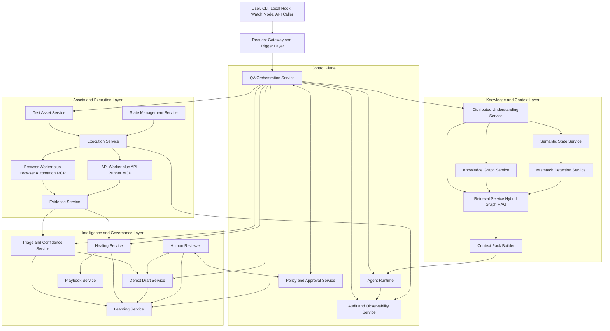
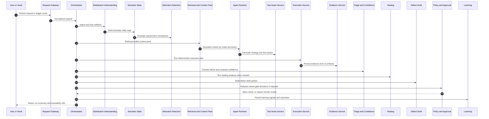
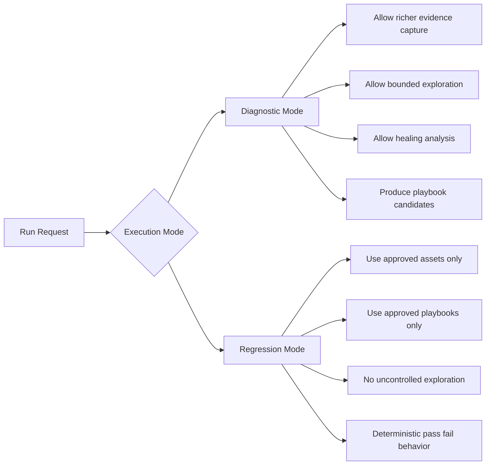

# AI QA Platform High Level System Diagram

This document summarizes the architecture in `api/doc/arc-design/architectural-design.md` as visual diagrams plus a component walkthrough.

## 1. Full System Picture

## 2. End to End Runtime Sequence

## 3. Diagnostic vs Regression Modes

## 4. How Each Component Works

| Component | What it does | Main inputs | Main outputs |
|---|---|---|---|
| Request Gateway and Trigger Layer | Accepts inbound requests from UI, CLI, hooks, API. Validates and normalizes requests. | request payload, trigger events | normalized request, correlation IDs, workflow kickoff |
| QA Orchestration Service | Controls workflow stages, retries, policy checks, and ordering. | normalized request, stage results | stage transitions, service calls, final run summary |
| Distributed Understanding Service | Reads case folders and browser readable sources. Fuses artifacts into structured understanding. | case files, parsed docs, browser captures | artifact records, chunkable summaries, provenance refs |
| Semantic State Service | Builds state map of pages, states, transitions, expected outcomes. | fused understanding, UI/API context | semantic state map, fingerprints, transition refs |
| Mismatch Detection Service | Detects contradictions across requirements, state map, and expected behavior before execution. | requirements, state map, expected outcomes | mismatch warnings, severity, blocking signals |
| Knowledge Graph Service | Stores explicit traceability relationships across requirements, tests, runs, and defects. | entities and links from understanding and runtime | relationship graph, impact neighborhoods |
| Retrieval Service Hybrid Graph RAG | Retrieves relevant chunks and graph neighbors using filters and mode aware policy. | retrieval query, case scope, mode | ranked candidate refs, retrieval logs |
| Context Pack Builder | Builds bounded prompt context with facts, refs, mismatches, and reusable assets. | retrieval results, policy constraints | context pack for agents |
| Agent Runtime | Runs role specific agents for mapping, strategy, authoring, triage, healing, learning. | context pack, task contract | structured agent outputs with confidence and refs |
| Test Asset Service | Produces strategies, scenarios, scripts, fixtures, and versioned assets. | agent outputs, templates, reusable assets | executable test assets, metadata, version links |
| State Management Service | Ensures deterministic preconditions, setup, and cleanup for runs. | run plan, environment policy | setup actions, cleanup actions, state readiness |
| Execution Service | Schedules and coordinates browser and API workers under policy and mode constraints. | test assets, playbooks, state setup | run steps, execution status, worker events |
| Browser Worker plus Browser Automation MCP | Executes web steps and assertions, collects browser evidence. | browser plan, selectors, state signals | screenshots, traces, logs, assertion results |
| API Worker plus API Runner MCP | Executes API flows and assertions with controlled auth/session setup. | API test plan, fixtures | request/response evidence, assertion results |
| Evidence Service | Stores evidence, builds bundles and summaries, and returns evidence refs. | raw artifacts from workers | evidence refs, bundles, semantic traces |
| Triage and Confidence Service | Classifies failures and computes confidence with evidence grounding. | run outcomes, evidence bundles, history | triage result, confidence, recommended action |
| Healing Service | Performs forensic healing analysis and proposes safe updates. | failed steps, fingerprints, historical healing | healing suggestions, healing logs |
| Playbook Service | Promotes validated diagnostic discoveries into deterministic playbooks. | approved healing outcomes, stable patterns | approved playbooks for regression mode |
| Defect Draft Service | Builds defect quality packets with repro, expected/actual, and evidence refs. | triage result, evidence, requirement links | defect drafts, review ready packets |
| Policy and Approval Service | Applies action tier policy and human gate logic for risky actions. | proposed actions, confidence, mode | allow, deny, or review decisions |
| Audit and Observability Service | Captures full trace of decisions, tool calls, and stage timings. | all workflow and service events | audit logs, telemetry, debugging views |
| Learning Service | Converts outcomes and reviewer feedback into reusable signals. | triage outcomes, healing outcomes, review decisions | learning signals, retrieval boosts, quality improvements |
| Human Reviewer | Reviews uncertain outputs and approves blocked or risky decisions. | review tasks, defect drafts, healing proposals | approval decisions, corrections, feedback |

## 5. Operational Reading Guide

Use this sequence to reason about failures quickly:

1. Check `Orchestrator` stage timeline.
2. Check `Mismatch Detection` output before execution.
3. Check `Execution Service` and worker run-step logs.
4. Check `Evidence Service` bundles for missing or weak evidence.
5. Check `Triage and Confidence` rationale.
6. Check `Policy and Approval` decision path.
7. Check `Learning` signal writeback for future runs.

