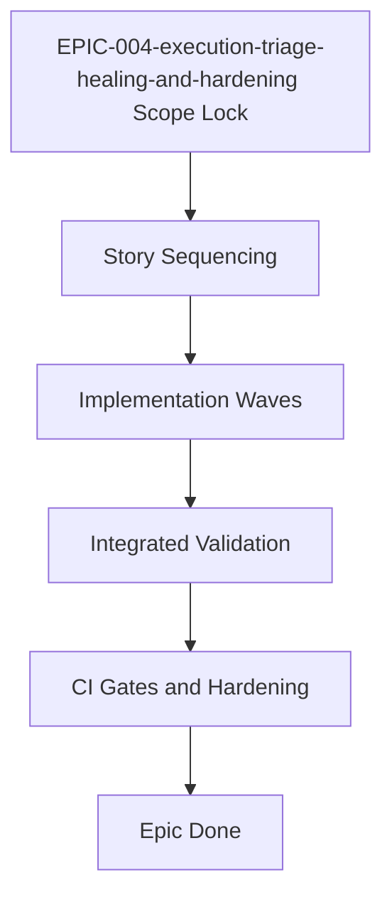
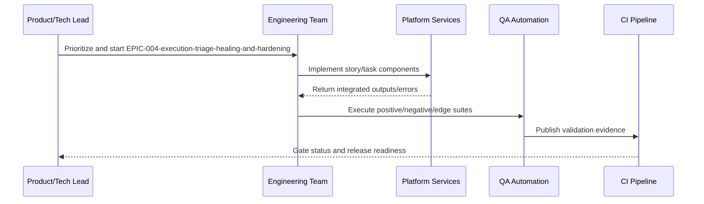

# EPIC-004-execution-triage-healing-and-hardening Detailed Implementation Guide

## Ticket Reference

- Source: `api/doc/workitem/EPIC-004-execution-triage-healing-and-hardening.md`
- Type: `epic`

## 1. Environment Setup Steps

1. Start from `cd api`, activate `.venv`, and install dev dependencies.
1. Stand up local profile first, then integration profile with DB/vector/graph/event-bus services.
1. Enable deterministic negative testing flags for epic-level reliability validation.

## 2. Resources Required / Dependencies

- `api/doc/impl-plan/detailed-implementation-plan.md`
- `api/doc/arc-design/architectural-design.md`
- Related implementation design docs for the epic scope

**Upstream dependencies**
- `EPIC-003-rag-agent-runtime-and-assets.md`

## 3. Dependent Components

- All stories and tasks under this epic boundary.
- Downstream epics that consume outputs from this epic.

## 4. Detailed Process Flow (Step-by-Step)

1. Confirm epic scope and lock sprint slicing.
2. Sequence stories by dependency and identify parallelizable tasks.
3. Implement contracts/data changes before runtime logic.
4. Integrate policy, audit, and observability hooks per story.
5. Execute story-level test suites including negative and edge coverage.
6. Run epic-level end-to-end traceability validation.
7. Enforce CI gates and release checklist for epic completion.

## 5. Process Flow Diagram

## 6. Sequence Diagram

## 7. Test Plan and Coverage Target (>= 85%)

- Scenario catalog size: **24**
- Minimum scenarios that must pass: **21** (>= 85%)
- Coverage composition: 10 happy-path, 7 negative, 5 edge, 2 failpoint/recovery.

## 8. Implementation Checklist

- [ ] Story/task dependency order completed
- [ ] End-to-end traceability preserved across epic scope
- [ ] Negative and edge scenario target met (>=85%)
- [ ] CI and operational gates green for epic exit
