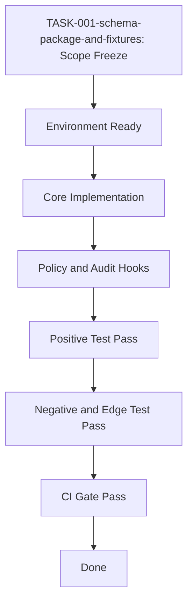
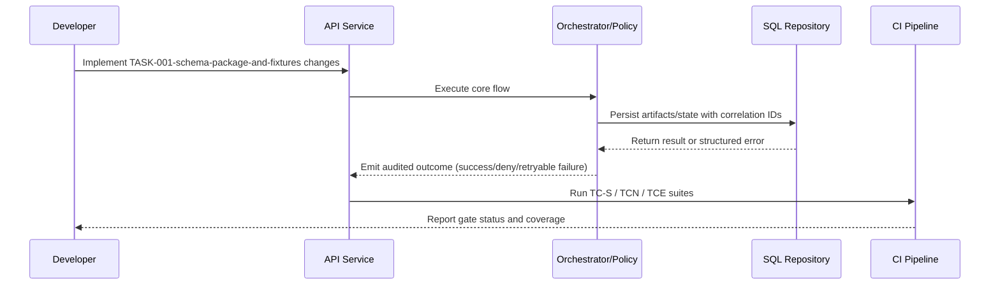

# TASK-001-schema-package-and-fixtures Detailed Implementation Guide

## Ticket Reference

- Source: `api/doc/workitem/TASK-001-schema-package-and-fixtures.md`
- Type: `task`
- Sprint candidate: `Sprint 1`

## 1. Environment Setup Steps

1. From repository root run: `cd api`
1. Create and activate venv: `python -m venv .venv` then `.venv\\Scripts\\activate`
1. Install dependencies: `pip install -e .[dev,runner]`
1. Install browser runtime when needed: `python -m playwright install chromium`
1. Set baseline env profile variables from implementation plan section 2.4/2.5/2.6.
1. Use `local-dev` first, then validate on `integration` with PostgreSQL.
1. Enable deterministic failure tests with `AI_QA_TEST_FAULT_INJECTION=true` for negative-path validation.

## 2. Resources Required / Dependencies

**Required references and assets**
- Implementation plan: `api/doc/impl-plan/detailed-implementation-plan.md`
- Architecture: `api/doc/arc-design/architectural-design.md`
- Data model design
- MCP contract design
- Service design (outbox/saga/policy/audit)

**Upstream dependencies**
- `STORY-001-contract-and-enum-lock.md`

## 3. Dependent Components

**Upstream components**
- `STORY-001-contract-and-enum-lock.md`

**Downstream components impacted by this ticket**
- `TASK-002-canonical-enum-constants.md`

## 4. Detailed Process Flow (Step-by-Step)

1. Confirm scope boundaries in TASK-001-schema-package-and-fixtures and freeze acceptance criteria from the source ticket.
2. Verify upstream dependencies are complete: STORY-001-contract-and-enum-lock.md.
3. Prepare environment profile (local-dev then integration) and seed required synthetic fixtures.
4. Implement contract/model changes first (schemas, constants, DTOs, DB fields) before service logic.
5. Implement the core TASK-001 Schema Package And Fixtures service flow with idempotency and correlation-id propagation.
6. Integrate policy and audit hooks so blocked paths and successful paths are both traceable.
7. Add failure handling with deterministic failpoints for timeout/retry/crash scenarios as applicable.
8. Implement positive-path tests mapped to existing TC-S* cases in the ticket.
9. Implement negative and edge-path tests mapped to TCN-* and TCE-* catalog entries.
10. Run unit + contract + integration suites, then capture evidence and update ticket checklist status.

## 5. Process Flow Diagram

## 6. Sequence Diagram

## 7. Test Plan and Coverage Target (>= 85%)

- Scenario catalog size: **13**
- Minimum scenarios that must pass: **12** (>= 85%)
- Ticket baseline test IDs: TC-S0-001, TC-S0-002, TCN-S0-001, TCN-S0-002, TCE-S0-001

| Scenario Category | Target Count | Coverage Focus |
|---|---:|---|
| Happy path | 5 | Core task behavior and expected side effects |
| Negative path | 4 | Invalid input, denied action, contract/error payload checks |
| Edge conditions | 3 | Size/concurrency/determinism edge behaviors |
| Recovery/failpoint | 1 | Bounded retry/recovery assertion |

**Assertion standards**
- Structured error payloads include `errorCode`, `message`, `retryable`, `correlationId`.
- Duplicate/replay/out-of-order events do not corrupt persisted state.
- Deterministic mode: same input and snapshot yields structurally equivalent output.
- Secrets are masked in logs and test artifacts.

## 8. Implementation Checklist

- [ ] Contracts/schemas and enums updated first (if applicable)
- [ ] Service logic implemented with idempotency and policy checks
- [ ] Audit/correlation logging verified
- [ ] Unit + contract + integration + negative + edge tests implemented
- [ ] Coverage threshold satisfied (>= 85% scenario catalog)
- [ ] CI gates green and ticket acceptance criteria met
