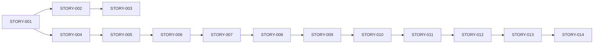
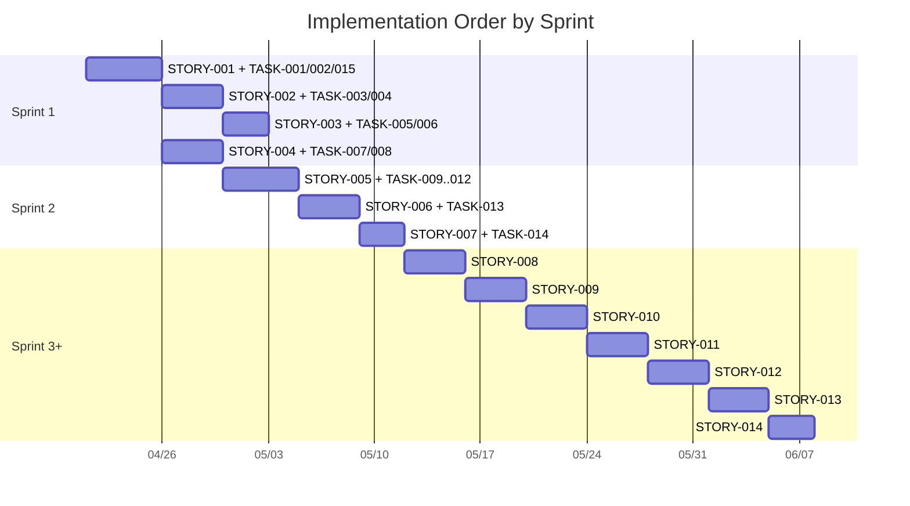
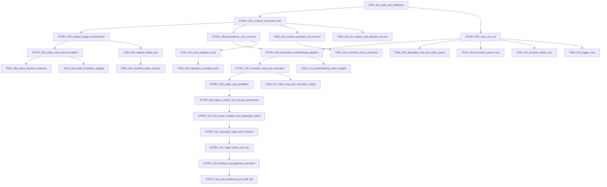

# Workitem Implementation Order Diagram

## High-Level Order (Story Chain)

## Sprint-Oriented Execution Order

## Ticket Dependency Graph (Stories + Tasks)

## Usage

- Follow story chain top-to-bottom; enforce dependency completion before starting downstream items.
- Within each story, execute task guides in dependency order from `api/doc/workitem/implementation-guides/`.
